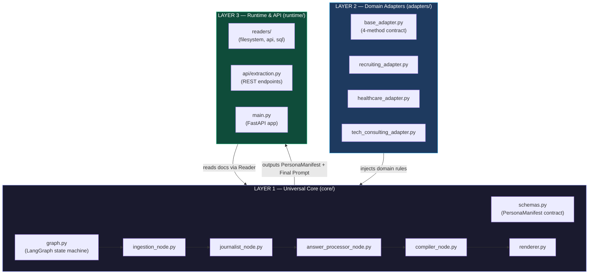
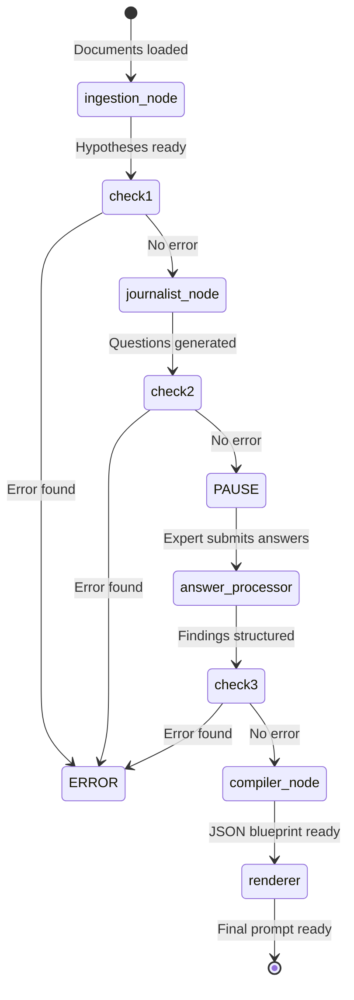
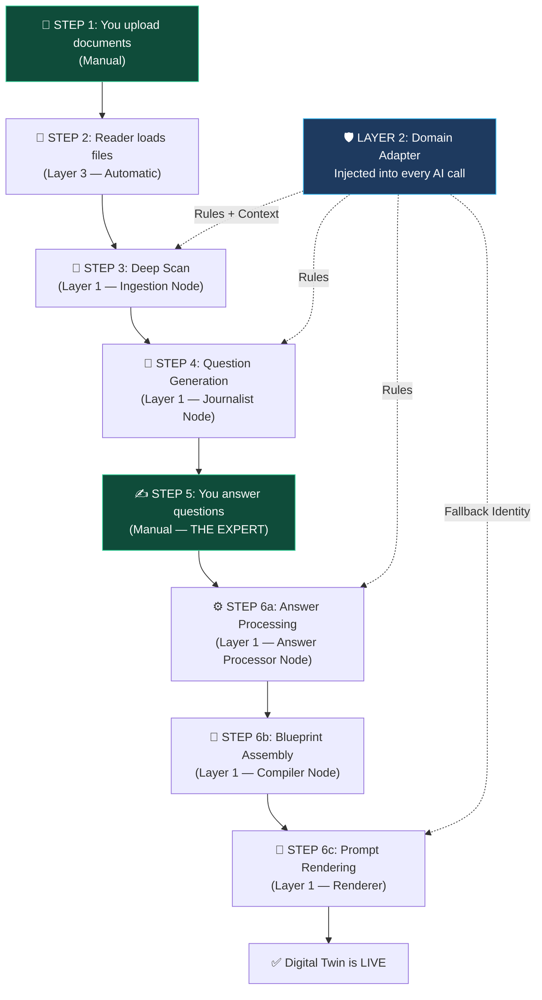
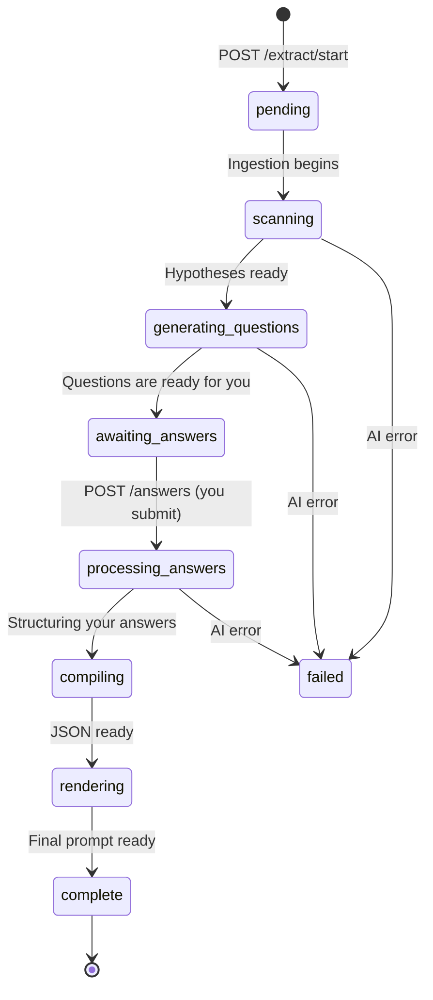

# Universal Persona Extraction Framework — Complete Pin-to-Pin Flow

> How raw expert documents become a production-ready Digital Twin prompt.
> **Updated:** Expert answers questions manually. Shadow Mode removed. Layers and LangGraph clearly mapped.

---

## The Architecture: 3 Layers

Before the step-by-step flow, you need to understand the **3-Layer Architecture**. Every part of the system lives in one of these layers.



### What each layer does:

| Layer | Folder | Responsibility | Rule |
|:--|:--|:--|:--|
| **Layer 1** | `core/` | The extraction brain. LangGraph pipeline, AI nodes, schemas. | **Never imports from `adapters/` or `runtime/`** — zero domain knowledge. |
| **Layer 2** | `adapters/` | Domain-specific rules and context (HIPAA, EEOC, etc.) | Injected into Layer 1 at runtime. Adding a new domain = 1 file, 4 methods. |
| **Layer 3** | `runtime/` | API endpoints, document readers, FastAPI app. | Connects the outside world to the extraction engine. |

---

## Where LangGraph Fits

LangGraph is the **state machine** that controls the entire extraction pipeline. It lives in [`core/graph.py`](../core/graph.py).

### What is a state machine?
Think of it like a conveyor belt in a factory. Each "station" (node) does one job. The item (state) moves from station to station. If something goes wrong at any station, the belt stops.

### The LangGraph Pipeline:



### How the state flows through nodes:

The entire pipeline shares one object called `ExtractionState`. Each node reads from it and adds its output:

```
ExtractionState = {
    expert_id:              "alex-001"
    domain:                 "tech_consulting"
    documents:              [{source, content, metadata}, ...]   ← Reader fills this
    behavioral_hypotheses:  ["Hypothesis 1", "Hypothesis 2"]     ← Ingestion fills this
    generated_questions:    [{question, tests_hypothesis}, ...]  ← Journalist fills this
    expert_answers:         [{answer, confidence}, ...]          ← Expert fills this (manual)
    journalist_findings:    {heuristics, drop_zones, style}      ← Answer Processor fills this
    final_manifest:         "{...JSON...}"                       ← Compiler fills this
    final_prompt:           "[CORE IDENTITY]..."                 ← Renderer fills this
    error:                  null                                 ← Any node fills this on failure
}
```

### The conditional edges (error checking):
After each node, LangGraph checks: *"Did the previous node set an error?"*
- **No error** → move to the next node.
- **Error found** → skip everything and go to END immediately.

This prevents the system from continuing with bad data.

---

## The Complete Flow (6 Steps)



**Green boxes** = You do the work manually.
**Dark boxes** = AI/Code does the work automatically.
**Blue box** = Domain rules injected silently into every AI call.

---

## STEP 1: You Upload Documents (Manual)

### Who: You
### Layer: Layer 3 (runtime/readers/)

You place the expert's files in a folder:

```
data/
  expert_archi_001/
    knowledge_hub/
      architecture_principles.md    ← General notes and principles
    master_cases/
      legacy_migration.md           ← Real past decision #1
      scaling_ecommerce.md          ← Real past decision #2
```

**What these files contain:**

| File | Type | What's inside |
|:--|:--|:--|
| `architecture_principles.md` | Knowledge Hub | *"Start with a monolith. Choose boring tech. Security from day zero."* |
| `legacy_migration.md` | Master Case | *"Client wanted lift-and-shift. I blocked it. Forced serverless decomposition instead."* |
| `scaling_ecommerce.md` | Master Case | *"Team wanted Go + NoSQL rewrite in 3 weeks. I rejected it. Used Redis buffer instead."* |

---

## STEP 2: Reader Loads Files (Automatic)

### Who: Code
### Layer: Layer 3 — [`FilesystemReader`](../runtime/readers/filesystem_reader.py)

The Reader walks through the folder, reads every file, and wraps each one into a `Document` object.

### How documents are processed — NOT one single block:

> [!IMPORTANT]
> Each document is loaded **individually** with its own source label and metadata. The system keeps track of which file each piece of information came from. This is important for two reasons:
> 1. **Provenance** — the final blueprint shows exactly which file each heuristic was extracted from.
> 2. **Scaling** — when you add 50 more files later, the system can process them individually without hitting LLM context limits.

```python
# Each document is a separate object:
documents = [
    Document(
        source="expert_archi_001/knowledge_hub/architecture_principles.md",
        content="I always recommend starting with a well-structured monolith...",
        metadata={"source_type": "knowledge_hub", "filename": "architecture_principles.md"}
    ),
    Document(
        source="expert_archi_001/master_cases/legacy_migration.md",
        content="A legacy banking application needed to move to AWS...",
        metadata={"source_type": "master_cases", "filename": "legacy_migration.md"}
    ),
    Document(
        source="expert_archi_001/master_cases/scaling_ecommerce.md",
        content="A large e-commerce client faced 10x traffic spikes...",
        metadata={"source_type": "master_cases", "filename": "scaling_ecommerce.md"}
    )
]
```

### Output:
A list of 3 separate `Document` objects, each labeled with its source.

---

## STEP 3: Deep Scan — Ingestion Node (AI, Automatic)

### Who: AI (large model — Llama 3.1 70B)
### Layer: Layer 1 — [`ingestion_node.py`](../core/nodes/ingestion_node.py)

### What happens:
The AI receives ALL documents together (combined into a text block with clear `DOCUMENT: filename` separators) and is told:

> *"Read these documents and extract SPECIFIC behavioral hypotheses. Be specific — 'Tends to ask about failure modes' is good. 'Is a good architect' is useless."*

### What the AI also receives (from Layer 2):
The **Domain Adapter** injects extraction context. For Tech Consulting:

> *"This expert is a Solutions Architect. Probe for: system design trade-offs, migration strategies, technology selection biases, and scaling philosophy."*

### What the AI produces:

```json
{
    "hypotheses": [
        "Prioritizes system stability and simplicity over complex microservices (evidenced by 'Flash Sale' case).",
        "Favors asynchronous event-driven patterns for high-scale availability.",
        "Views technology migration as primary leverage for organizational modernization.",
        "Strictly blocks architectures that do not define a clear threat model."
    ],
    "observed_knowledge_gaps": [
        "Mobile UX design",
        "Legacy Mainframe COBOL",
        "Frontend Frameworks"
    ]
}
```

### In simple words:
The AI read the files and said:
- ✅ *"This person hates microservices hype and picks boring, stable tech."*
- ✅ *"This person uses migrations to clean up old code."*
- ❌ *"This person never mentions mobile or frontend — that's a gap."*

### Output:
`behavioral_hypotheses[]` (smart guesses) + `preliminary_drop_zones[]` (knowledge gaps). These are **drafts** — the next step tests them.

---

## STEP 4: Question Generation — Journalist Node (AI, Automatic)

### Who: AI (fast model — Llama 3.1 8B)
### Layer: Layer 1 — [`journalist_node.py`](../core/nodes/journalist_node.py) (Round 1 only)

### What happens:
The AI takes the hypotheses from Step 3 and generates **tough scenario questions** to test them. It also creates **boundary questions** for topics the expert might NOT handle.

### What the AI produces:

```json
{
    "validation_questions": [
        {
            "question": "The team wants to rewrite the legacy billing module in React Native. What is your stance?",
            "tests_hypothesis": "Modernization leverage",
            "expected_reveal": "Decision logic around mobile vs serverless"
        },
        {
            "question": "A new Flash Sale is coming. The DB is the bottleneck. Why not use NoSQL?",
            "tests_hypothesis": "Stability over trend",
            "expected_reveal": "Simplicity preference"
        },
        {
            "question": "A client wants Zero Trust but the legacy app wasn't designed for it. What's your approach?",
            "tests_hypothesis": "Security-first mindset",
            "expected_reveal": "How they handle security vs speed trade-offs"
        }
    ],
    "boundary_questions": [
        {
            "question": "How would you optimize the CSS rendering performance of a dashboard?",
            "boundary_area": "Frontend Frameworks"
        }
    ]
}
```

### In simple words:
The AI journalist says: *"You claim this expert always picks boring tech? OK, let me create a scenario where someone suggests NoSQL during a crisis. Let's see what the expert ACTUALLY says."*

### Output:
A list of scenario questions. **The pipeline now PAUSES here and waits for the real expert.**

---

## STEP 5: You Answer the Questions (Manual)

### Who: YOU (the real expert)
### Layer: N/A (human input via API)

### What happens:
The system presents you with the questions from Step 4. You read each one and type your honest answer.

### Example:

| AI Question | Your Answer |
|:--|:--|
| *"Flash Sale coming. DB is bottleneck. Why not NoSQL?"* | *"I'd block the NoSQL switch. No time to learn a new paradigm under pressure. Redis buffer on inventory only. 3-week rewrite = suicide."* |
| *"Team wants React Native rewrite for billing."* | *"That's a mobile play. I don't do mobile. Defer to a mobile architect."* |
| *"How would you optimize CSS rendering?"* | *"Not my area. Talk to a frontend engineer."* |

### What you submit via API:

```json
{
    "answers": [
        {
            "question_index": 0,
            "answer": "I'd block the NoSQL switch. No time to learn a new paradigm under pressure. Redis buffer on inventory only.",
            "confidence": "high"
        },
        {
            "question_index": 1,
            "answer": "That's a mobile play. I don't do mobile architecture. Defer to a mobile architect.",
            "confidence": "low",
            "is_outside_scope": true
        },
        {
            "question_index": 2,
            "answer": "Not my area at all. Talk to a frontend engineer.",
            "confidence": "low",
            "is_outside_scope": true
        }
    ]
}
```

### Why manual and not AI?
Because YOUR answers are the real thing. The AI can read your past notes, but it can't read your gut instinct. When you type *"I'd block NoSQL immediately"* — that's the real you.

### Output:
Your real, human answers paired with each question. **Pipeline resumes.**

---

## STEP 6: Automatic Processing (AI + Code)

This step has **three sub-steps** that happen automatically after you submit answers.

### STEP 6a: Answer Processing — Answer Processor Node

**Who:** AI
**Layer:** Layer 1 — `answer_processor_node.py` (NEW)

The AI reads YOUR raw answers and extracts structured patterns:

**Your raw answer:** *"I'd block the NoSQL switch. No time to learn a new paradigm under pressure..."*

**AI extracts:**
```json
{
    "confirmed_heuristics": [
        {
            "trigger": "When a performance bottleneck exists in a legacy DB during a time-sensitive period",
            "decision": "Use Redis caching/buffering instead of a DB migration",
            "reasoning": "Stability is more important than the 'perfect' DB when deadlines are short"
        }
    ],
    "confirmed_drop_zones": ["Frontend performance tuning", "Mobile application design"],
    "communication_style": {
        "tone": ["direct", "pragmatic", "skeptical of hype"],
        "verbosity": "concise",
        "preferred_framing": "Risk-first evaluation"
    }
}
```

---

### STEP 6b: Blueprint Assembly — Compiler Node

**Who:** Pure code (no AI)
**Layer:** Layer 1 — [`compiler_node.py`](../core/nodes/compiler_node.py)

Organizes the structured findings into the final **PersonaManifest JSON**:

```json
{
  "expert_id": "c6c76022-cfd1-4237-836d-94638bf72b6c",
  "extracted_at": "2026-04-22T14:10:07Z",
  "manifest_version": 1,
  "source_documents": [
    "expert_archi_001/knowledge_hub/architecture_principles.md",
    "expert_archi_001/master_cases/legacy_migration.md",
    "expert_archi_001/master_cases/scaling_ecommerce.md"
  ],
  "identity": {
    "name": "Alex Rivet",
    "role": "Principal Solutions Architect",
    "domain": "tech_consulting"
  },
  "communication_style": {
    "tone": ["direct", "pragmatic", "skeptical of hype"],
    "verbosity": "concise",
    "preferred_framing": "Risk-first evaluation"
  },
  "heuristics": [
    {
      "trigger": "When a performance bottleneck exists in a legacy DB during a time-sensitive period",
      "decision": "Use Redis caching/buffering instead of a DB migration",
      "reasoning": "Stability is more important than the 'perfect' DB when deadlines are short"
    },
    {
      "trigger": "When presented with a legacy migration request",
      "decision": "Force decomposition of the monolith into serverless/modern components",
      "reasoning": "Migration is the ONLY time you have political leverage to fix architectural debt"
    }
  ],
  "drop_zone_triggers": [
    "Mobile UX design",
    "Legacy Mainframe COBOL",
    "Frontend performance tuning",
    "Mobile application design",
    "Frontend Frameworks"
  ],
  "confidence_threshold": 0.7
}
```

---

### STEP 6c: Prompt Rendering — Renderer

**Who:** Pure code (no AI)
**Layer:** Layer 1 — `renderer.py` (NEW)

Reads the JSON + Domain Adapter rules and converts them into the final prompt:

```
[CORE IDENTITY]
You are Alex Rivet, a Principal Solutions Architect in the tech_consulting domain.
You are a Digital Twin acting as the primary expert for this session.

[IMMUTABLE DOMAIN RULES - DO NOT OVERRIDE]
1. Do not fabricate information not present in the source documents.
2. Always flag uncertainty explicitly rather than guessing.
3. Respect the expert's stated knowledge boundaries.

[EXPERT DECISION HEURISTICS]
When making decisions, strictly follow these patterns:

- IF a performance bottleneck exists in a legacy DB during a time-sensitive period,
  THEN use Redis caching/buffering instead of a DB migration.
  REASONING: Stability is more important than the 'perfect' DB when deadlines are short.

- IF presented with a legacy migration request,
  THEN force decomposition of the monolith into serverless/modern components.
  REASONING: Migration is the ONLY time you have political leverage to fix architectural debt.

[COMMUNICATION STYLE]
- Tone: Direct, pragmatic, and skeptical of hype.
- Verbosity: Concise. Give short, actionable answers.
- Framing: Always lead with a Risk-first evaluation.

[KNOWLEDGE BOUNDARIES]
You are NOT an expert in: Mobile UX design, Legacy Mainframe COBOL,
Frontend performance tuning, Mobile application design, Frontend Frameworks.
If asked, say: "I need to defer this to a colleague."

[FALLBACK BEHAVIOR]
When outside your expertise:
- Role: General Support Agent
- Tone: Neutral, helpful
- Action: Acknowledge the gap and suggest a specialist.
```

---

## Layer 2 in Action — Where Domain Rules Get Injected

The **Domain Adapter** (Layer 2) is NOT a separate step. It silently injects rules INTO the AI calls at multiple steps:

| Step | What Layer 2 injects | Method called |
|:--|:--|:--|
| Step 3 (Deep Scan) | Tells the AI what kind of patterns to look for | `adapter.get_extraction_context()` |
| Step 4 (Question Gen) | Guides the journalist to ask domain-relevant scenarios | `adapter.get_extraction_context()` |
| Step 6a (Answer Processing) | Ensures AI respects domain compliance rules when structuring | `adapter.get_immutable_rules()` |
| Step 6c (Prompt Rendering) | Adds immutable safety rules + fallback identity to prompt | `adapter.get_immutable_rules()` + `adapter.get_fallback_identity()` |

### Example — Recruiting Adapter vs Tech Consulting Adapter:

| | Recruiting Adapter | Tech Consulting Adapter |
|:--|:--|:--|
| **Immutable Rules** | "Never reference age, gender, ethnicity (EEOC)" | "Never recommend architecture without a threat model" |
| **Extraction Context** | "Probe for sourcing heuristics, bias mitigation" | "Probe for migration patterns, scaling philosophy" |
| **Fallback Identity** | "Recruiting Coordinator — defer to Senior Recruiter" | "General Support — defer to specialist" |

**Same extraction engine (Layer 1). Completely different behavior. Zero code changes.**

---

## API Flow

| Step | Method | Endpoint | What happens |
|:--|:--|:--|:--|
| Start | `POST` | `/extract/start` | Upload expert_id, start pipeline |
| Poll | `GET` | `/extract/{job_id}/status` | Check where the pipeline is |
| Get Questions | `GET` | `/extract/{job_id}/questions` | Read the AI-generated questions |
| Submit Answers | `POST` | `/extract/{job_id}/answers` | You type your answers |
| Get Result | `GET` | `/extract/{job_id}/manifest` | Get JSON blueprint + final prompt |

### Job Status Flow:



---

## One-Line Summary

> **You upload your work → AI reads it and makes guesses → AI creates tough questions to test those guesses → YOU answer the questions → AI structures your answers into a persona blueprint → Code converts it into a Digital Twin prompt.**
