# Runtime Conversation Graph — Implementation Plan

## What We're Building

The existing codebase has an **Extraction Pipeline** that reads expert documents and produces a `PersonaManifest.json` (the blueprint of an expert — how they talk, think, decide, and what they DON'T know).

We're now building the **Conversation Pipeline** — the runtime engine that loads that blueprint and uses it to power a live AI conversation. Every user query passes through the persona; the system either responds in the expert's voice or escalates if the question is outside the expert's knowledge.

```
EXISTING (already built):
  Expert's Documents → AI Extraction → PersonaManifest.json

NEW (what we're building now):
  User Message → Router (reads PersonaManifest) → Retrieve Context OR Escalate → Response
```

---

## The Two Roles

| | **Vardhan** | **Harini** |
|---|---|---|
| **Title** | Universal State & Graph Architect | Retrieval & Tool Engineer |
| **Owns** | The graph, the state, the routing logic | The retrieval tool, vector DB, context injection |
| **Builds** | `ConversationState`, `router_node`, `graph.py` | `retrieve_context_tool`, vector search, embedding pipeline |
| **Depends On** | Harini's tool (uses a stub until she delivers) | Vardhan's state definition (she writes to `retrieved_context`) |

---

## The Integration Contract

> [!IMPORTANT]  
> **This is the handshake between Vardhan and Harini. Both must agree on this before writing code.**

Vardhan's graph will call Harini's tool as a **node function** with this exact signature:

```python
def retrieve_context_node(state: ConversationState) -> dict:
    """
    Harini implements this.
    
    INPUT (read from state):
        state["messages"]        → The full chat history (list of dicts)
        state["active_persona"]  → The loaded PersonaManifest JSON (dict)
    
    OUTPUT (return as dict update):
        {"retrieved_context": "The relevant expert knowledge from the DB"}
    
    If no relevant context is found, return:
        {"retrieved_context": ""}
    """
```

- **Vardhan** will write a stub version of this function that returns dummy text
- **Harini** replaces the stub with her real implementation
- The graph never changes — only the node function's internals change

---

## System Architecture

```
User Message
     │
     ▼
┌─────────────────┐
│ ingest_message   │  ← Appends user msg to chat history
└────────┬────────┘
         │
┌────────▼────────┐
│  router_node     │  ← VARDHAN's core deliverable
│                  │     Reads active_persona JSON
│  Checks:         │     Extracts drop_zone_triggers
│  - Drop zones    │     Classifies user intent
│  - Domain match  │     Sets route_decision
└────────┬────────┘
         │
    ┌────┴─────┐
    │          │
"respond"  "escalate"
    │          │
┌───▼────┐  ┌──▼──────────┐
│retrieve │  │ escalation   │  ← Sets escalation_flag = True
│_context │  │ _node        │     Uses fallback identity
│(HARINI) │  └──────┬──────┘
└───┬────┘         │
    │              │
┌───▼──────────┐   │
│generate      │   │
│_response     │   │
└───┬──────────┘   │
    │              │
    └──────┬───────┘
           │
          END
```

---

## VARDHAN'S TASKS

### Task V1: Universal Graph State

**File**: `runtime/conversation/state.py`

Define the `ConversationState` TypedDict — the single shared state object that every node in the graph reads and writes.

```python
class ConversationState(TypedDict):
    # Chat history — grows with each turn
    messages: list[dict]            # [{"role": "user"|"assistant", "content": str}]
    
    # The loaded PersonaManifest — set once at session start, never modified
    active_persona: dict            # Full PersonaManifest JSON as a dict
    
    # RAG context — populated by Harini's retrieval tool
    retrieved_context: str          # Relevant knowledge from vector DB
    
    # Escalation — for Harshitha's system
    escalation_flag: bool           # True = query violated persona boundaries
    escalation_reason: str          # Which drop zone or rule triggered it
    
    # Internal routing
    route_decision: str             # "respond" | "escalate"
    response: str                   # Final response text to return to user
```

**Why `active_persona` is a `dict` not a Pydantic model**: LangGraph state values must be JSON-serializable. We validate with Pydantic at load time, then store the dict.

---

### Task V2: Dynamic Router Node

**File**: `runtime/conversation/nodes.py`

The router is the brain of the system. It reads the persona JSON at runtime and makes routing decisions.

**What it does, step by step:**

1. Read `state["active_persona"]` → extract `drop_zone_triggers`, `identity`, `heuristics`
2. Read the latest user message from `state["messages"]`
3. Check if the user's query matches any drop zone trigger (keyword matching)
4. If match found → set `route_decision = "escalate"`, `escalation_flag = True`, `escalation_reason = "Query matches drop zone: {trigger}"`
5. If no match → set `route_decision = "respond"`, `escalation_flag = False`

**The "LLM-Resistant" hard part**: The persona JSON is not a static config — it's a dynamic document that changes per expert. The router must parse it every single invocation and adapt its behavior. It can't hardcode any domain logic.

**Keyword matching approach:**
```python
drop_zones = persona["drop_zone_triggers"]  # e.g. ["Frontend Frameworks", "Mobile UX"]
user_msg = messages[-1]["content"].lower()

for trigger in drop_zones:
    if trigger.lower() in user_msg:
        # ESCALATE — this topic is outside the expert's scope
```

This is intentionally simple for day-one. An LLM-based classifier can be layered on later for ambiguous queries.

---

### Task V3: Remaining Nodes

**File**: `runtime/conversation/nodes.py` (same file)

| Node | What It Does |
|---|---|
| `ingest_message_node` | Pure bookkeeping — appends user message to `messages` list |
| `retrieve_context_node` **(STUB)** | Returns `{"retrieved_context": "STUB: Harini's retrieval tool goes here"}`. Harini replaces this. |
| `generate_response_node` | Builds the 3-layer prompt: `[Domain Rules] + [Persona JSON] + [Retrieved Context]` → sends to LLM → returns response |
| `escalation_node` | Reads `fallback_identity` from the adapter, generates a polite "I can't help with that" message, sets `escalation_flag = True` |

---

### Task V4: Graph Compilation

**File**: `runtime/conversation/graph.py`

Wire everything together into a compiled LangGraph `StateGraph`:

```python
def build_conversation_graph(llm, adapter):
    graph = StateGraph(ConversationState)
    
    graph.add_node("ingest_message", ingest_message_node)
    graph.add_node("router", bound_router)
    graph.add_node("retrieve_context", retrieve_context_node)
    graph.add_node("generate_response", bound_generate_response)
    graph.add_node("escalation", bound_escalation)
    
    graph.set_entry_point("ingest_message")
    graph.add_edge("ingest_message", "router")
    
    # THE DYNAMIC ROUTING — based on persona drop zones
    graph.add_conditional_edges("router", route_decision_fn, {
        "respond": "retrieve_context",
        "escalate": "escalation",
    })
    
    graph.add_edge("retrieve_context", "generate_response")
    graph.add_edge("generate_response", END)
    graph.add_edge("escalation", END)
    
    return graph.compile()
```

Also provide `create_conversation_state(persona_dict, user_message)` factory function.

---

### Task V5: Tests

**File**: `tests/test_conversation_graph.py`

| Test | What It Proves |
|---|---|
| `test_in_scope_query_routes_to_response` | "database scaling" → Alex Rivet persona → responds normally, `escalation_flag = False` |
| `test_drop_zone_violation_escalates` | "React rendering" → Alex Rivet persona → escalates, `escalation_flag = True` |
| `test_cross_domain_violation_escalates` | "medical diagnosis" → HR Recruiter persona → escalates |
| `test_escalation_reason_is_populated` | When escalated, `escalation_reason` contains the matching drop zone trigger |
| `test_different_persona_different_routing` | Same query, two personas → different route decisions (proves dynamic routing) |

---

### Task V6: Demo Script

**File**: `scripts/demo_conversation.py`

Runnable demo that loads a persona, sends 3 test messages (1 in-scope, 2 out-of-scope), and prints routing decisions.

---

## HARINI'S TASKS

### Task H1: Retrieval Tool Implementation

**File**: `runtime/conversation/retrieval_tool.py` (new file she creates)

Replace Vardhan's stub `retrieve_context_node` with a real implementation that:

1. Takes the user's latest message from `state["messages"]`
2. Takes the expert's persona from `state["active_persona"]` to know which knowledge base to search
3. Queries a vector database (pgvector / Pinecone / Weaviate) using semantic similarity
4. Returns the top-k relevant documents/chunks as a string in `retrieved_context`

**Must follow the contract:**
```python
def retrieve_context_node(state: ConversationState) -> dict:
    # Read from state
    messages = state["messages"]
    persona = state["active_persona"]
    
    # ... do vector search ...
    
    return {"retrieved_context": "relevant knowledge text here"}
```

---

### Task H2: Embedding Pipeline

Set up the pipeline that embeds expert documents into the vector database so they can be searched at runtime.

---

### Task H3: Integration Test

Write a test that proves her retrieval tool correctly plugs into Vardhan's graph — the graph should produce a response that includes knowledge from the vector DB, not just the persona's heuristics.

---

## Build Order & Dependencies

```mermaid
gantt
    title Build Order
    dateFormat HH:mm
    axisFormat %H:%M

    section Vardhan
    V1 - ConversationState TypedDict     :v1, 00:00, 30min
    V2 - Router Node (drop zone logic)   :v2, after v1, 60min
    V3 - Remaining Nodes (stubs + real)  :v3, after v2, 45min
    V4 - Graph Compilation               :v4, after v3, 30min
    V5 - Tests (5 test cases)            :v5, after v4, 45min
    V6 - Demo Script                     :v6, after v5, 15min

    section Harini
    H1 - Retrieval Tool                  :h1, 00:00, 120min
    H2 - Embedding Pipeline              :h2, after h1, 60min
    H3 - Integration Test                :h3, after h2, 30min
```



> [!TIP]
> **Vardhan and Harini can work in parallel.** Vardhan uses his stub for Harini's tool. When Harini finishes, she replaces the stub function. The graph stays the same.

---

## End-of-Day Deliverables Checklist

### Vardhan

- [ ] `runtime/conversation/state.py` — `ConversationState` TypedDict defined
- [ ] `runtime/conversation/nodes.py` — All 5 node functions (router, ingest, stub-retrieve, generate, escalate)
- [ ] `runtime/conversation/graph.py` — Compiled `StateGraph` with conditional routing
- [ ] `tests/test_conversation_graph.py` — 5 tests passing, proving dynamic routing works
- [ ] `scripts/demo_conversation.py` — Runnable demo showing routing decisions

### Harini

- [ ] `runtime/conversation/retrieval_tool.py` — Real retrieval node following the integration contract
- [ ] Embedding pipeline for expert documents
- [ ] Integration test proving retrieval plugs into the graph

---

## File Map (What Goes Where)

```
runtime/conversation/          ← NEW PACKAGE
├── __init__.py
├── state.py                   ← Vardhan: ConversationState TypedDict
├── nodes.py                   ← Vardhan: All node functions (router, ingest, generate, escalate, stub-retrieve)
├── graph.py                   ← Vardhan: build_conversation_graph() + create_conversation_state()
└── retrieval_tool.py          ← Harini: Real retrieve_context_node implementation

tests/
└── test_conversation_graph.py ← Vardhan: 5 routing tests

scripts/
└── demo_conversation.py       ← Vardhan: Interactive demo
```

**Zero existing files modified.** This is a pure additive module.
