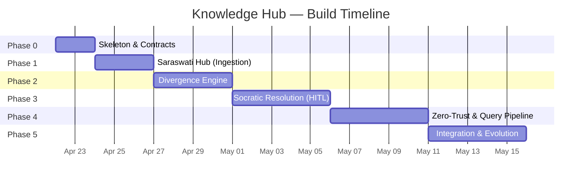

# Implementation Approach — Digital Twin Knowledge Hub

> **Goal**: Build the "Brain Factory" — a production-grade EITL pipeline that extracts expert knowledge from documents and transforms it into a deterministic, queryable Digital DNA.
> **Perspective**: Phased, risk-ordered delivery. Ship vertical slices, not horizontal layers.

---

## Guiding Principles

Before diving into phases, these principles will govern every decision:

| # | Principle | Rationale |
|---|---|---|
| 1 | **Contract-First** | Define Pydantic schemas and API contracts *before* writing business logic. Every node in the graph operates on typed state. |
| 2 | **Vertical Slices** | Each phase delivers an end-to-end working feature, not an isolated layer. Phase 1 should ingest a doc AND store it in the DB. |
| 3 | **Fail Fast, Fail Loud** | Every LLM call has a Pydantic validator. Every validator has a fallback. Every fallback has a log. Silent failures are the enemy. |
| 4 | **Expert Time is Sacred** | The expert's time is the most expensive resource. Every design decision should minimize how many times we interrupt them. |
| 5 | **Glass Box, Not Black Box** | Every decision the Twin makes must be traceable to a source document, an expert transcript, or an explicit rule. |

---

## Project Structure

```
knowledge_hub/
├── docs/                          # Ingested source documents (existing)
├── backend/
│   ├── app/
│   │   ├── main.py                # FastAPI entry point
│   │   ├── config.py              # Env vars, Supabase keys, model configs
│   │   ├── models/
│   │   │   ├── state.py           # GraphState (Pydantic) — the shared state object
│   │   │   ├── schemas.py         # DB schemas, API request/response models
│   │   │   └── enums.py           # ImpactArchetype, RiskLevel, etc.
│   │   ├── graph/
│   │   │   ├── pipeline.py        # LangGraph definition — nodes, edges, conditionals
│   │   │   ├── nodes/
│   │   │   │   ├── ingestion.py   # Stage 1: Hierarchical Parser
│   │   │   │   ├── divergence.py  # Stage 2: Soft-Rule Scanner
│   │   │   │   ├── slm_filter.py  # Stage 3: SLM Hallucination Pre-Filter
│   │   │   │   ├── socratic.py    # Stage 4: Socratic Resolution (HITL breakpoint)
│   │   │   │   ├── parser.py      # Stage 5: Structured Logic Parser
│   │   │   │   └── audit.py       # Stage 6: Visual Audit & Commit
│   │   │   └── edges.py           # Conditional routing (retry loops, bypass)
│   │   ├── services/
│   │   │   ├── supabase.py        # Supabase client, vector ops
│   │   │   ├── llm.py             # LLM provider abstraction (OpenAI, etc.)
│   │   │   ├── slm.py             # SLM provider for Echo Verification
│   │   │   ├── embeddings.py      # Embedding generation service
│   │   │   └── stt.py             # Speech-to-Text service
│   │   └── api/
│   │       ├── ingest.py          # POST /ingest — upload & trigger pipeline
│   │       ├── scenarios.py       # GET /scenarios — fetch pending scenarios
│   │       ├── resolve.py         # POST /resolve — submit expert response
│   │       └── query.py           # POST /query — runtime inference
│   ├── tests/
│   └── requirements.txt
├── frontend/                      # React (Social Learner UI, Audit Dashboard)
└── supabase/
    └── migrations/                # SQL migrations for Ganesha Logic Vault
```

---

## Phase 0 — Skeleton & Contracts (Day 1–2)

### What
Stand up the project skeleton, define all shared contracts, and wire the empty LangGraph pipeline.

### Why
> [!IMPORTANT]
> This is the phase most teams skip and most projects regret. Getting the state model right *before* writing LLM calls prevents expensive refactors later.

### Deliverables

- [ ] **GraphState (Pydantic)** — the single source of truth flowing through the pipeline:
  ```python
  class GraphState(BaseModel):
      document_id: str
      raw_chunks: list[DocumentChunk]       # Stage 1 output
      decision_gaps: list[DecisionGap]      # Stage 2 output
      synthetic_scenarios: list[Scenario]   # Stage 2 output
      slm_audit_results: list[AuditResult]  # Stage 3 output
      expert_transcripts: list[Transcript]  # Stage 4 output
      parsed_cases: list[MasterCase]        # Stage 5 output
      impact_classifications: list[Impact]  # Stage 6 output
      retry_count: int = 0
      audit_log: list[AuditEntry] = []
  ```
- [ ] **Supabase migration** — create the `master_cases` table, enable pgvector extension.
- [ ] **LangGraph skeleton** — all 6 nodes wired with `pass-through` implementations, conditional edges stubbed.
- [ ] **FastAPI skeleton** — `/ingest`, `/scenarios`, `/resolve`, `/query` endpoints returning mock data.

### Acceptance Criteria
✅ `python -m pytest` passes with all stubs.
✅ LangGraph pipeline can be invoked end-to-end with mock state.
✅ Supabase migration runs cleanly.

---

## Phase 1 — Saraswati Hub: Document Ingestion (Day 3–5)

### What
Build the Hierarchical Parser that converts raw PDFs/DOCX into a structured, searchable knowledge graph stored in Supabase.

### Why
Everything downstream depends on high-quality document decomposition. Garbage in = garbage out.

### Deliverables

- [ ] **Hierarchical Parser** (`nodes/ingestion.py`):
  - Parse DOCX using `python-docx` — extract heading hierarchy (H1 → H2 → H3 → body).
  - Parse PDF using `pymupdf` or `unstructured` — extract structural sections.
  - Output: `list[DocumentChunk]` with `parent_id`, `level`, `content`, `source_path`.
- [ ] **Embedding Generation** (`services/embeddings.py`):
  - Generate 1536-dim embeddings for each chunk using OpenAI `text-embedding-3-small`.
  - Store in Supabase `document_chunks` table with pgvector column.
- [ ] **API Endpoint** (`api/ingest.py`):
  - `POST /ingest` — accepts file upload, triggers Stage 1, returns `document_id`.
- [ ] **Verification Query**:
  - `POST /query/search` — basic semantic search over ingested chunks to validate embeddings work.

### Technical Decisions
| Decision | Choice | Rationale |
|---|---|---|
| PDF Parser | `pymupdf` (fitz) | Fastest, handles complex layouts, MIT license |
| Embedding Model | `text-embedding-3-small` | 1536-dim, cost-effective, strong retrieval performance |
| Chunking Strategy | Heading-aware hierarchical | Documents have clear H1/H2/H3 structure — leverage it, don't throw it away |

### Acceptance Criteria
✅ Upload the 4 existing docs → all are parsed into hierarchical chunks.
✅ Semantic search for "Emergency Bypass" returns relevant chunks from LL_arch.
✅ Parent-child relationships are preserved in the DB.

---

## Phase 2 — Divergence Engine & Scenario Generation (Day 6–9)

### What
Build the LLM-powered nodes that scan ingested documents for Decision Gaps and generate Synthetic Scenarios.

### Why
This is where the system transitions from "document store" to "intelligence engine." Without this, we're just a fancy search box.

### Deliverables

- [ ] **Divergence Node** (`nodes/divergence.py`):
  - Scan each chunk for semantic markers: *"typically"*, *"generally"*, *"usually"*, *"in most cases"*, *"consider"*.
  - Flag these as `DecisionGap` objects with `gap_type`, `source_chunk_id`, `ambiguous_text`.
- [ ] **Synthesis Node** (extension of divergence):
  - For each `DecisionGap`, generate a `Scenario` — a complex, multi-variable clinical test case.
  - Example: _"A 38-year-old patient with PCOS, BMI 32, and a history of failed IUI. The protocol says 'typically start with low-dose FSH.' What would you do?"_
- [ ] **SLM Auditor Node** (`nodes/slm_filter.py`):
  - Feed each scenario through a smaller model.
  - Ask: _"Does this scenario introduce any medical facts, drug names, or conditions not present in the source chunk?"_
  - If yes → **Safety Halt** → flag for human review.
  - If no → scenario approved for expert presentation.
- [ ] **Conditional Edge** (`edges.py`):
  - If SLM detects hallucination → route back to Synthesis with a constraint to stay grounded.
  - Max 3 retries → escalate to manual scenario creation.

### Technical Decisions
| Decision | Choice | Rationale |
|---|---|---|
| SLM | `gpt-4o-mini` or `claude-3-haiku` | Low cost, fast, sufficient for binary audit tasks |
| Divergence prompt | Few-shot with examples | More reliable than zero-shot for detecting nuanced "soft rules" |
| Scenario complexity | 3–5 variables per scenario | Enough to force expert judgment, not so complex it's unrealistic |

### Acceptance Criteria
✅ Running divergence on `Business Overview.docx` chunks flags at least 3 Decision Gaps.
✅ Generated scenarios are grounded — SLM audit pass rate > 80% on first attempt.
✅ Safety Halt triggers correctly for a fabricated scenario.

---

## Phase 3 — Socratic Resolution & HITL (Day 10–14)

### What
Build the Human-in-the-Loop interface where the expert reviews scenarios and provides verbal responses, which are then parsed into structured logic.

### Why
> [!IMPORTANT]
> This is the **core value differentiator** — where expert intuition becomes data. Everything before this is preprocessing; everything after is validation.

### Deliverables

- [ ] **LangGraph Breakpoint** (`nodes/socratic.py`):
  - Use `interrupt()` to pause the graph at Stage 4.
  - Persist state to Supabase so the expert can respond asynchronously (could be hours/days later).
- [ ] **Social Learner UI** (React):
  - Dashboard showing pending scenarios grouped by document.
  - Each scenario card shows: source text, generated scenario, gap type.
  - **Record** button → captures audio via browser MediaRecorder API.
  - **Submit** → sends audio to STT service, then resumes the graph.
- [ ] **STT Integration** (`services/stt.py`):
  - Use OpenAI Whisper API or browser-native Web Speech API for MVP.
  - Output: raw transcript text.
- [ ] **Structured Parser Node** (`nodes/parser.py`):
  - LLM (GPT-4o) parses transcript into `MasterCase` schema:
    ```python
    class MasterCase(BaseModel):
        expert_decision: str
        chain_of_thought: list[str]
        logic_tags: list[str]
        confidence_note: Optional[str]
        source_chunk_id: str
        scenario_id: str
    ```
  - Pydantic validates the output — if it doesn't conform, retry with tighter prompt.

### Technical Decisions
| Decision | Choice | Rationale |
|---|---|---|
| STT | OpenAI Whisper API | Best accuracy for medical terminology, async via API |
| State persistence | Supabase `pipeline_state` table | Expert may respond hours later — need durable state |
| Audio capture | Browser MediaRecorder API | No additional dependencies, works on modern browsers |

### Acceptance Criteria
✅ Expert can view pending scenarios on a React dashboard.
✅ Audio recording → STT → transcript flow works end-to-end.
✅ Transcript is parsed into a valid `MasterCase` that passes Pydantic validation.
✅ Graph resumes correctly after HITL breakpoint.

---

## Phase 4 — Zero-Trust Defense & Production Hardening (Day 15–19)

### What
Implement the full Hallucination Defense Matrix, the Visual Audit gate, and the runtime query pipeline.

### Why
Without this, the system is a prototype. With this, it's production-grade.

### Deliverables

- [ ] **Echo Verification** (`nodes/audit.py`):
  - SLM compares the parsed `MasterCase` against the original transcript.
  - Asks: _"Did the parsing AI add, remove, or alter the expert's actual decision?"_
  - Binary output: `PASS` or `CONFLICT`.
- [ ] **Recursive Retry Edge** (`edges.py`):
  - If `CONFLICT` → re-run parser at `temperature=0.0` with explicit instruction to be literal.
  - After 3 failures → trigger Verbal Fallback (flag for expert re-recording).
- [ ] **Impact Archetype Gate** (React + API):
  - Dashboard showing parsed cases pending expert classification.
  - Expert selects: **Safety** / **Structural** / **Informational**.
  - Only after classification → commit to `master_cases` table.
- [ ] **Runtime Query Pipeline** (`api/query.py`):
  - Intent Router → Risk Assessment → Vector Search → Confidence Check → Response/Escalation.
  - Confidence thresholds: `>0.90` autonomous, `0.75–0.90` HITL, `<0.75` graceful deferral.
- [ ] **Emergency Bypass** (pre-processing middleware):
  - Keyword/pattern detection for high-risk terms.
  - If triggered → skip all logic → route directly to doctor's priority queue.

### Technical Decisions
| Decision | Choice | Rationale |
|---|---|---|
| Retry temperature | `0.0` | Zero creativity — forces literal transcription of expert's words |
| Confidence metric | Cosine similarity on pgvector | Native to Supabase, no external dependency |
| Emergency keywords | Configurable list in DB | Clinicians can update without developer deployment |

### Acceptance Criteria
✅ Echo Verification catches an intentionally mutated `MasterCase`.
✅ Recursive retry successfully self-corrects on at least 1 test case.
✅ Visual Audit gate prevents uncommitted cases from appearing in query results.
✅ Query with cosine similarity > 0.90 returns autonomous response.
✅ Emergency keyword triggers bypass correctly.

---

## Phase 5 — Integration & Evolution (Day 20+)

### What
Connect the Knowledge Hub to the existing Digital Twin (`js_dt`) and establish the continuous learning loop.

### Deliverables

- [ ] **Connect to Existing Twin** — Wire the `/query` endpoint to the existing `js_dt` backend's message handling flow.
- [ ] **Knowledge Versioning** — Implement version tracking on `master_cases` (version column, `created_at`, `superseded_by`).
- [ ] **Expert Correction Loop** — When the Twin gives an autonomous answer and the expert later corrects it, capture the correction as a new `MasterCase` with higher priority.
- [ ] **Analytics Dashboard** — Track: total cases, gaps per document, SLM audit pass rate, average confidence scores.
- [ ] **Contextual Jacketing** — Define the technical implementation for industry-specific behavior (prompt prefixes, config-driven rules, or feature flags).

---

## Open Questions for You

> [!IMPORTANT]
> These decisions will shape the implementation. I need your input before we start coding.

1. **SLM Choice**: The documents mention a "smaller deterministic model" but don't name one. Are you leaning toward `gpt-4o-mini`, `claude-3-haiku`, or a local model like `phi-3`?

2. **Speech-to-Text**: For the MVP, do you want to use OpenAI Whisper API (best accuracy, async, costs money) or browser-native Web Speech API (free, real-time, lower accuracy for medical terms)?

3. **Existing `js_dt` Integration**: Should the Knowledge Hub be a *separate* service that the existing `js_dt` backend calls, or should we merge them into a single backend?

4. **Expert Access**: Will the expert (doctor) be using the same React frontend as the existing Digital Twin, or do they need a separate, dedicated interface?

5. **Contextual Jacket**: For now, are we building this exclusively for the Healthcare/Fertility domain, or should the architecture support multi-industry from Day 1?

6. **Embedding Model**: The docs say 1536-dim. Do you want to use `text-embedding-3-small` (1536-dim, cheaper) or `text-embedding-3-large` (3072-dim, better retrieval)?

---

## Risk Register

| Risk | Impact | Mitigation |
|---|---|---|
| Expert availability for HITL | High — blocks Phase 3 entirely | Design for async; expert can respond days later via persistent state |
| LLM cost explosion during divergence scanning | Medium — each doc generates N scenarios × M retries | Cap scenarios per document; batch processing; use SLM where possible |
| Embedding model deprecation | High — requires full re-indexing | Abstract embedding service; store model version alongside vectors |
| STT accuracy for medical terms | Medium — bad transcripts → bad parsing | Use domain-specific Whisper fine-tune or post-processing medical NER |
| Scope creep into runtime Twin features | High — infinite feature surface | Hard boundary: Knowledge Hub *feeds* the Twin; it doesn't *become* the Twin |

---

## Summary Timeline


