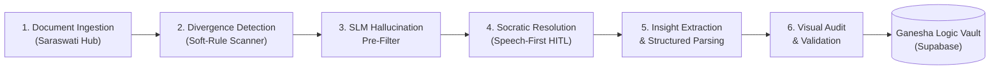
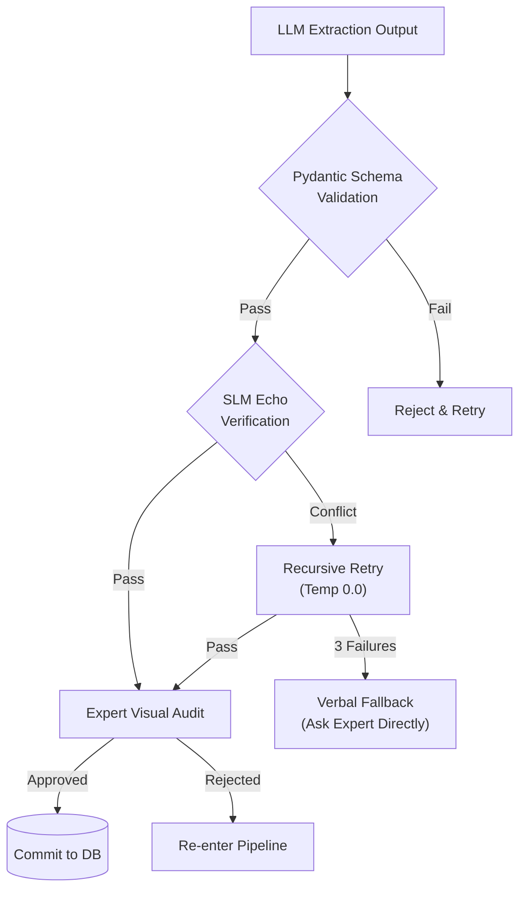
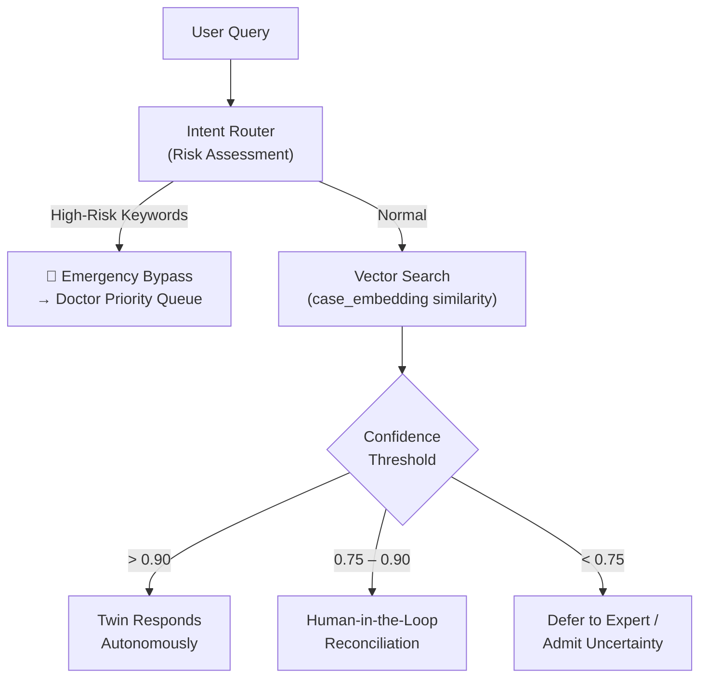

# Document Understanding — Digital Twin Knowledge Hub

> **Scope**: Synthesis of 4 ingested documents — *Business Overview*, *HL Architecture*, *LL Architecture*, and *Implementation Plan*.
> **Perspective**: Senior Architect — focus on system boundaries, data flow, trust boundaries, and integration points.

---

## 1. Business Problem Statement

The documents describe a system called the **Unified Socratic Extraction Framework** — an **EITL (Expert-in-the-Loop)** pipeline designed to solve three core failures in deploying AI in high-stakes domains:

| Problem | Description |
|---|---|
| **3-Month Expiry** | AI models are static snapshots; they go stale as new protocols and expert insights emerge. |
| **Probability Gap** | Generic LLMs "guess" the next token — this creates hallucinations that are unacceptable in clinical/structural environments. |
| **Expert Bottleneck** | High-value experts cannot be everywhere at once, yet generic AI cannot be trusted to substitute them. |

> [!IMPORTANT]
> The core thesis is: **Expertise is a structured dataset, not a vague conversation.** The system treats expert knowledge as extractable, parseable, auditable data — not free-form text.

---

## 2. The Solution: "Brain Factory" (EITL Pipeline)

The system is a **6-stage extraction pipeline** that converts raw, unstructured expert documents into a deterministic, versioned **Digital DNA**:

### Stage-by-Stage Breakdown

#### Stage 1 — Document Ingestion ("Saraswati" Knowledge Hub)
- **Input**: Unstructured PDFs, DOCX files.
- **Process**: A **Hierarchical Parser** decomposes documents into a parent-child graph: `Section → Sub-section → Protocol → Leaf`.
- **Output**: A structured, searchable knowledge graph.
- **Tech**: FastAPI service, Supabase pgvector (1536-dim embeddings).

#### Stage 2 — Divergence Detection
- **Purpose**: Find where textbook knowledge is *insufficient* — i.e., where an expert's intuition is actually needed.
- **Mechanism**: An LLM scans for **semantic markers** — words like *"typically"*, *"generally"*, *"usually"* — and flags them as **Decision Gaps**.
- **Output**: A set of flagged "soft rules" where the document is ambiguous.

#### Stage 3 — SLM Hallucination Pre-Filter
- **Purpose**: Guardrail before the expert even sees anything.
- **Mechanism**: A **smaller, deterministic model (SLM)** audits the synthetically generated scenarios. If a scenario introduces facts *not* grounded in the source document, a **Safety Halt** is triggered.
- **Key Insight**: This is a *pre-interview* filter — it prevents the expert from being asked about fabricated scenarios.

#### Stage 4 — Socratic Resolution (Speech-First)
- **Purpose**: Capture the expert's **unique decision-making logic AND persona** (tone, bedside manner — "The Soul").
- **Mechanism**: Scenarios are presented via a **Social Learner UI (React dashboard)**. The expert responds verbally; **Speech-to-Text (STT)** captures the response.
- **Key Insight**: Speech-first is deliberate — it preserves nuances lost in typed responses.

#### Stage 5 — Insight Extraction & Structured Parsing
- **Purpose**: Convert raw transcript into deterministic, queryable data.
- **Mechanism**: A high-reasoning LLM (e.g., GPT-4o) parses the transcript into a strict JSON schema:
  - `expert_decision` — the final deterministic action.
  - `chain_of_thought` — step-by-step reasoning.
  - `logic_tags` — metadata for retrieval (e.g., `["High-Risk", "Dosage_Change"]`).

#### Stage 6 — Visual Audit & Validation
- **Purpose**: Expert performs a **final gate check**.
- **Mechanism**: Parsed logic is displayed on a dashboard. The expert must confirm the **Impact Archetype**:
  - **Safety** — could harm a patient.
  - **Structural** — affects system/process integrity.
  - **Informational** — general knowledge, low risk.
- **Key Insight**: Nothing reaches the database without human sign-off.

---

## 3. Storage Schema — The "Ganesha" Logic Vault

All extraction results are persisted in **Supabase** with the following conceptual schema:

| Field | Purpose |
|---|---|
| `case_embedding` | 1536-dim vector for semantic search (pgvector) |
| `expert_decision` | The deterministic action/answer |
| `chain_of_thought` | Step-by-step reasoning trace |
| `logic_tags` | Searchable metadata tags |
| `impact_archetype` | Safety / Structural / Informational |
| `source_reference` | Traceability back to original document section |
| `audit_log` | Full history of extraction, retries, and sign-offs |

> [!NOTE]
> The documents reference tables and schemas but the actual column-level DDL was not included in the extracted text (likely in embedded tables/images in the DOCX). This will need to be reverse-engineered or confirmed with the domain team.

---

## 4. Security Model — The Hallucination Defense Matrix

The documents define a **Zero-Trust** verification layer with 4 cascading fallbacks:

| Layer | Mechanism | Purpose |
|---|---|---|
| **Layer 1** | Pydantic enforcement | Structural validation — output matches DB schema exactly |
| **Layer 2** | SLM "Echo" Verification | Semantic validation — did the AI *change* the expert's decision during parsing? |
| **Layer 3** | Recursive Retry (Temp 0.0) | Deterministic re-extraction — zero creativity to enforce literal accuracy |
| **Layer 4** | Verbal Fallback | Human escalation — if AI fails 3 times, ask the expert directly |

---

## 5. Query-Time Inference Flow

When an end-user asks a question of the Digital Twin at runtime:

> [!WARNING]
> The documents define confidence thresholds (`>0.90` autonomous, `0.75–0.90` HITL) but do **not** specify the behavior for `<0.75`. This is an open gap that needs an explicit policy — likely "graceful uncertainty" or hard escalation.

---

## 6. Tech Stack (As Defined in Documents)

| Layer | Technology | Role |
|---|---|---|
| **Orchestration** | LangGraph | Stateful, cyclic agentic graph with interrupt/breakpoint support |
| **API Layer** | FastAPI | Document ingestion service, query routing |
| **Database** | Supabase (PostgreSQL + pgvector) | Knowledge storage, vector search, real-time subscriptions |
| **Frontend** | React | Social Learner UI, Visual Audit dashboard |
| **LLM** | GPT-4o (or equivalent) | Divergence detection, scenario generation, transcript parsing |
| **SLM** | Smaller deterministic model | Hallucination auditing, Echo Verification |
| **STT** | Speech-to-Text engine | Expert persona capture |
| **State Management** | Pydantic (GraphState) | Typed state across LangGraph nodes |

---

## 7. Key Architectural Observations

> [!TIP]
> These are senior-architect-level observations — not from the documents, but *about* them.

1. **The "Contextual Jacket" pattern is powerful but underspecified.** The documents mention that industry-specific behavior (Healthcare vs. Education vs. Consulting) is achieved through "Contextual Jacketing," but no document defines what a Jacket *is* technically — is it a prompt prefix, a config file, a database row, or a feature flag? This needs to be designed.

2. **The pipeline is inherently batch, not streaming.** The 6-stage EITL flow is designed for *offline* expert knowledge extraction. The query-time flow (Section 5) is a separate, real-time system that *consumes* the extracted data. These are two distinct sub-systems with different SLAs.

3. **LangGraph is a strong choice for the extraction pipeline** — its native support for `interrupt()`, conditional edges, and stateful cycles maps cleanly onto the retry loops and HITL breakpoints described in the documents.

4. **The "Emergency Bypass" is a runtime concern, not an extraction concern.** It appears in both the LL Architecture and the Implementation Plan, but it belongs exclusively in the query-time inference path, not in the extraction pipeline. Mixing them will create architectural confusion.

5. **Missing: Versioning and Evolution Strategy.** The documents claim the Twin achieves "Continuous Evolution" through expert corrections, but there's no mention of version control for extracted logic — no diffing, no rollback, no A/B testing between knowledge versions. This is critical for production.

6. **Missing: Embedding Model Strategy.** The docs specify 1536-dim vectors (implying `text-embedding-ada-002` or similar), but don't address embedding model versioning or re-indexing strategy when the embedding model changes.
